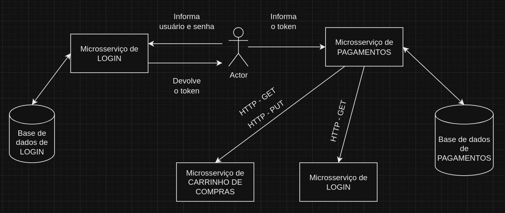

# FIAP-TechChallenge5-PAGAMENTOS

---

Quinto desafio da pós graduação da FIAP

---

Para executar o projeto junto com os outros microsserviços do desafio da FIAP-TechChallenge5,  na raiz do
projeto execute o docker-compose, pois ele provê a app e o banco de dados para se comunicar com os outros
microsserviços.

---

### Observações:

---

- Para executar os testes de `BDD`, a aplicação tem que estar rodando, juntamente com o banco de dados.
  Tem um docker-compose na raiz do projeto, ele provê a app, o banco de dados.

- Caso queira subir somente o banco de dados, para execucar a app localmente, tem um docker-compose no
  diretório `docker-banco-de-dados`.

- Para rodar os testes de performance com Gatling, execute o seguinte comando: `mvn gatling:test`
    - a aplicação tem que estar rodando, juntamente com o banco de dados. Tem um docker-compose na raiz do
      projeto, ele provê a app, o banco de dados.

---

### Integrações:

---

#### Que esse microsserviço utiliza:

- A aplicação comunica via HTTP com o microsserviço de LOGIN, para verificar se o cliente que veio
  pelo token JWT, realmente existe na base de dados, e também a aplicação se comunica via HTTP com
  o microsserviço de CARRINHO DE ITENS, para verificar se o carrinho que pertence ao usuário autenticado
realmente existe na base de dados, e está habilitado para ser realizado o pagamento do mesmo.

- Para realizar as operações neste microsserviço, é necessário estar autenticado. Para se autenticar,
  é necessário acessar o microsserviço de autenticação, e obter o token de acesso, via HTTP.

#### Que esse microsserviço fornece:

- A aplicação não fornece informações para outros microsserviços.
